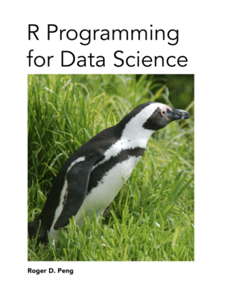

# Welcome

Data science has taken the world by storm. Every field of study and area of business has been affected as people increasingly realize the value of the incredible quantities of data being generated. But to extract value from those data, one needs to be trained in the proper data science skills. The R programming language has become the *de facto* programming language for data science. Its flexibility, power, sophistication, and expressiveness have made it an invaluable tool for data scientists around the world. 

This book is about the fundamentals of R programming. You will get started with the basics of the language, learn how to manipulate datasets, how to write functions, and how to debug and optimize code. With the fundamentals provided in this book, you will have a solid foundation on which to build your data science toolbox.

## Stay in Touch!

If you are interested in hearing more from me about things that I'm working on (books, data
science courses, podcast, etc.), you can do two things:

* First, I encourage you to join my mailing list of [Leanpub Readers](http://eepurl.com/bAJ3zj). On this list I send out updates of my own activities as well as occasional comments on data science current events. I'll also let you know what my co-conspirators Jeff Leek and Brian Caffo are up to because sometimes they do really cool stuff.
* Second, I have a regular podcast called [Not So Standard Deviations](https://soundcloud.com/nssd-podcast) that I co-host with Dr. Hilary Parker, a Data Scientist at Stitch Fix. On this podcast, Hilary and I talk about the craft of data science and discuss common issues and problems in analyzing data. We'll also compare how data science is approached in both academia and industry contexts and discuss the latest industry trends.  You can listen to recent episodes on our SoundCloud page or you can subscribe to it in [iTunes](https://itunes.apple.com/us/podcast/not-so-standard-deviations/id1040614570) or your favorite podcasting app.

For those of you who purchased a **printed copy** of this book, I encourage you to go to the Leanpub web site and [obtain the e-book version](https://leanpub.com/rprogramming), which is available for free. The reason is that I will occasionally update the book with new material and readers who purchase the e-book version are entitled to free updates (this is unfortunately not yet possible with printed books) and will be notified when they are released.

Thanks again for purchasing this book and please do stay in touch!
