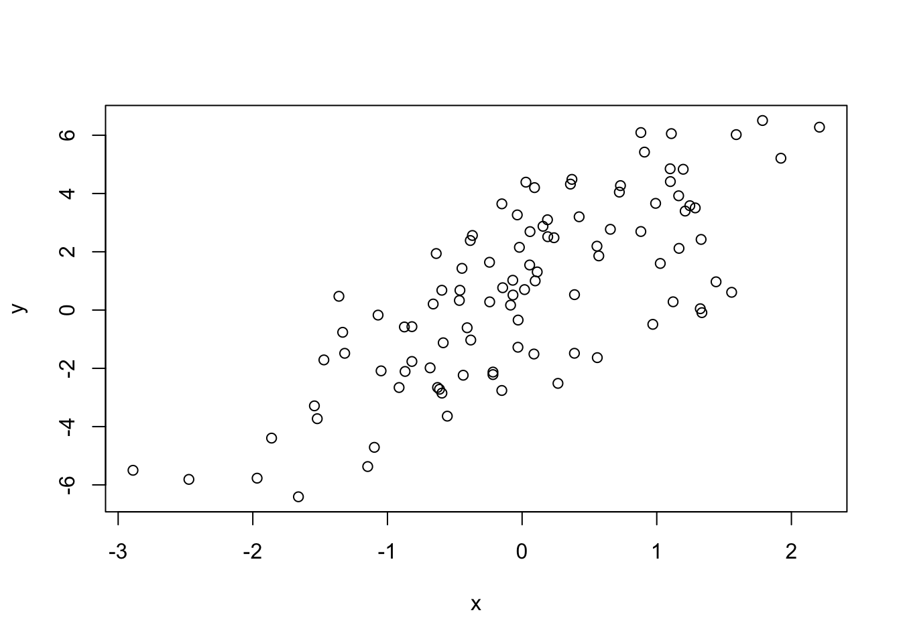
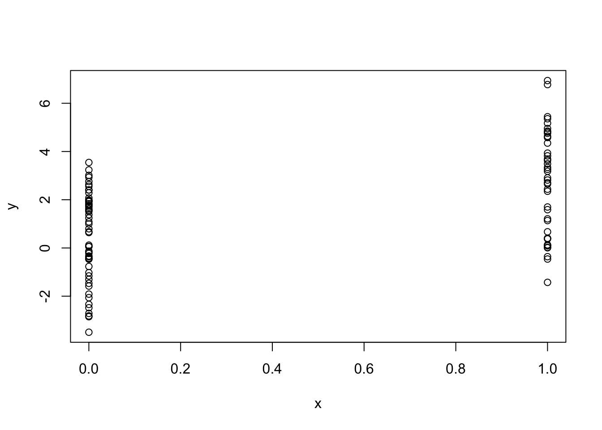
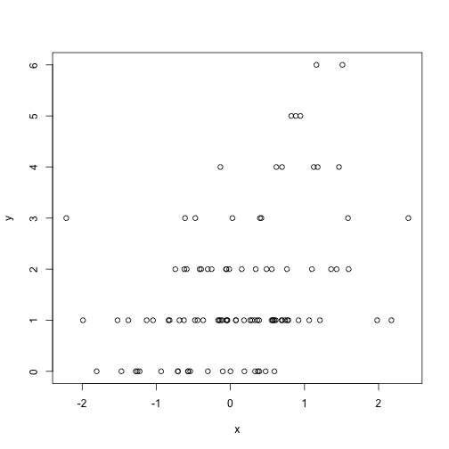

# Simulation

## Generating Random Numbers

[Watch a video of this section](https://youtu.be/tzz4flrajr0)

Simulation is an important (and big) topic for both statistics and for a variety of other areas where there is a need to introduce randomness. Sometimes you want to implement a statistical procedure that requires random number generation or sampling (i.e. Markov chain Monte Carlo, the bootstrap, random forests, bagging) and sometimes you want to simulate a system and random number generators can be used to model random inputs.

R comes with a set of pseudo-random number generators that allow you to simulate from well-known probability distributions like the Normal, Poisson, and binomial. Some example functions for probability distributions in R

- `rnorm`: generate random Normal variates with a given mean and standard deviation
- `dnorm`: evaluate the Normal probability density (with a given mean/SD) at a point (or vector of points)
- `pnorm`: evaluate the cumulative distribution function for a Normal distribution 
- `rpois`: generate random Poisson variates with a given rate

For each probability distribution there are typically four functions available that start with a "r", "d", "p", and "q". The "r" function is the one that actually simulates random numbers from that distribution. The other functions are prefixed with a

- `d` for density
- `r` for random number generation 
- `p` for cumulative distribution
- `q` for quantile function (inverse cumulative distribution)

If you're only interested in simulating random numbers, then you will likely only need the "r" functions and not the others. However, if you intend to simulate from arbitrary probability distributions using something like rejection sampling, then you will need the other functions too.

Probably the most common probability distribution to work with the is the Normal distribution (also known as the Gaussian). Working with the Normal distributions requires using these four functions

{line-numbers=off}
~~~~~~~~
dnorm(x, mean = 0, sd = 1, log = FALSE)
pnorm(q, mean = 0, sd = 1, lower.tail = TRUE, log.p = FALSE)
qnorm(p, mean = 0, sd = 1, lower.tail = TRUE, log.p = FALSE)
rnorm(n, mean = 0, sd = 1)
~~~~~~~~

Here we simulate standard Normal random numbers with mean 0 and standard deviation 1.

{line-numbers=off}
~~~~~~~~
> ## Simulate standard Normal random numbers
> x <- rnorm(10)   
> x
 [1]  0.01874617 -0.18425254 -1.37133055 -0.59916772  0.29454513
 [6]  0.38979430 -1.20807618 -0.36367602 -1.62667268 -0.25647839
~~~~~~~~

We can modify the default parameters to simulate numbers with mean 20 and standard deviation 2.

{line-numbers=off}
~~~~~~~~
> x <- rnorm(10, 20, 2) 
> x
 [1] 22.20356 21.51156 19.52353 21.97489 21.48278 20.17869 18.09011
 [8] 19.60970 21.85104 20.96596
> summary(x)
   Min. 1st Qu.  Median    Mean 3rd Qu.    Max. 
  18.09   19.75   21.22   20.74   21.77   22.20 
~~~~~~~~

If you wanted to know what was the probability of a random Normal variable of being less than, say, 2, you could use the `pnorm()` function to do that calculation.

{line-numbers=off}
~~~~~~~~
> pnorm(2)
[1] 0.9772499
~~~~~~~~

You never know when that calculation will come in handy.

## Setting the random number seed

When simulating any random numbers it is essential to set the *random number seed*. Setting the random number seed with `set.seed()` ensures reproducibility of the sequence of random numbers.

For example, I can generate 5 Normal random numbers with `rnorm()`.

{line-numbers=off}
~~~~~~~~
> set.seed(1)
> rnorm(5)
[1] -0.6264538  0.1836433 -0.8356286  1.5952808  0.3295078
~~~~~~~~

Note that if I call `rnorm()` again I will of course get a different set of 5 random numbers.

{line-numbers=off}
~~~~~~~~
> rnorm(5)
[1] -0.8204684  0.4874291  0.7383247  0.5757814 -0.3053884
~~~~~~~~

If I want to reproduce the original set of random numbers, I can just reset the seed with `set.seed()`.

{line-numbers=off}
~~~~~~~~
> set.seed(1)
> rnorm(5)    ## Same as before
[1] -0.6264538  0.1836433 -0.8356286  1.5952808  0.3295078
~~~~~~~~

In general, you should **always set the random number seed when conducting a simulation!** Otherwise, you will not be able to reconstruct the exact numbers that you produced in an analysis.

It is possible to generate random numbers from other probability distributions like the Poisson. The Poisson distribution is commonly used to model data that come in the form of counts. 

{line-numbers=off}
~~~~~~~~
> rpois(10, 1)    ## Counts with a mean of 1
 [1] 0 0 1 1 2 1 1 4 1 2
> rpois(10, 2)    ## Counts with a mean of 2
 [1] 4 1 2 0 1 1 0 1 4 1
> rpois(10, 20)   ## Counts with a mean of 20
 [1] 19 19 24 23 22 24 23 20 11 22
~~~~~~~~

## Simulating a Linear Model

[Watch a video of this section](https://youtu.be/p7kSSSsv4ms)

Simulating random numbers is useful but sometimes we want to simulate values that come from a specific *model*. For that we need to specify the model and then simulate from it using the functions described above.

Suppose we want to simulate from the following linear model

{$$}
y = \beta_0 + \beta_1 x + \varepsilon
{/$$}

where {$$}\varepsilon\sim\mathcal{N}(0,2^2){/$$}. Assume {$$}x\sim\mathcal{N}(0,1^2){/$$}, {$$}\beta_0=0.5{/$$} and {$$}\beta_1=2{/$$}. The variable `x` might represent an important predictor of the outcome `y`. Here's how we could do that in R.

{line-numbers=off}
~~~~~~~~
> ## Always set your seed!
> set.seed(20)             
> 
> ## Simulate predictor variable
> x <- rnorm(100)          
> 
> ## Simulate the error term
> e <- rnorm(100, 0, 2)    
> 
> ## Compute the outcome via the model
> y <- 0.5 + 2 * x + e     
> summary(y)
   Min. 1st Qu.  Median    Mean 3rd Qu.    Max. 
-6.4080 -1.5400  0.6789  0.6893  2.9300  6.5050 
~~~~~~~~

We can plot the results of the model simulation.

{line-numbers=off}
~~~~~~~~
> plot(x, y)
~~~~~~~~

What if we wanted to simulate a predictor variable `x` that is binary instead of having a Normal distribution. We can use the `rbinom()` function to simulate binary random variables.

{line-numbers=off}
~~~~~~~~
> set.seed(10)
> x <- rbinom(100, 1, 0.5)
> str(x)    ## 'x' is now 0s and 1s
 int [1:100] 1 0 0 1 0 0 0 0 1 0 ...
~~~~~~~~

Then we can proceed with the rest of the model as before.

{line-numbers=off}
~~~~~~~~
> e <- rnorm(100, 0, 2)
> y <- 0.5 + 2 * x + e
> plot(x, y)
~~~~~~~~

We can also simulate from *generalized linear model* where the errors are no longer from a Normal distribution but come from some other distribution. For examples, suppose we want to simulate from a Poisson log-linear model where

{$$}
Y \sim Poisson(\mu)
{/$$}

{$$}
\log \mu = \beta_0 + \beta_1 x
{/$$}

and {$$}\beta_0=0.5{/$$} and {$$}\beta_1=0.3{/$$}. We need to use the `rpois()` function for this

{line-numbers=off}
~~~~~~~~
> set.seed(1)
> 
> ## Simulate the predictor variable as before
> x <- rnorm(100)    
~~~~~~~~

Now we need to compute the log mean of the model and then exponentiate it to get the mean to pass to `rpois()`.

{line-numbers=off}
~~~~~~~~
> log.mu <- 0.5 + 0.3 * x
> y <- rpois(100, exp(log.mu))
> summary(y)
   Min. 1st Qu.  Median    Mean 3rd Qu.    Max. 
   0.00    1.00    1.00    1.55    2.00    6.00 
> plot(x, y)
~~~~~~~~

You can build arbitrarily complex models like this by simulating more predictors or making transformations of those predictors (e.g. squaring, log transformations, etc.).

## Random Sampling

[Watch a video of this section](https://youtu.be/-7GA10KWDJg)

The `sample()` function draws randomly from a specified set of (scalar) objects allowing you to sample from arbitrary distributions of numbers.

{line-numbers=off}
~~~~~~~~
> set.seed(1)
> sample(1:10, 4)
[1] 3 4 5 7
> sample(1:10, 4)
[1] 3 9 8 5
> 
> ## Doesn't have to be numbers
> sample(letters, 5)    
[1] "q" "b" "e" "x" "p"
> 
> ## Do a random permutation
> sample(1:10)          
 [1]  4  7 10  6  9  2  8  3  1  5
> sample(1:10)
 [1]  2  3  4  1  9  5 10  8  6  7
> 
> ## Sample w/replacement
> sample(1:10, replace = TRUE)  
 [1] 2 9 7 8 2 8 5 9 7 8
~~~~~~~~

To sample more complicated things, such as rows from a data frame or a list, you can sample the indices into an object rather than the elements of the object itself.

Here's how you can sample rows from a data frame.

{line-numbers=off}
~~~~~~~~
> library(datasets)
> data(airquality)
> head(airquality)
  Ozone Solar.R Wind Temp Month Day
1    41     190  7.4   67     5   1
2    36     118  8.0   72     5   2
3    12     149 12.6   74     5   3
4    18     313 11.5   62     5   4
5    NA      NA 14.3   56     5   5
6    28      NA 14.9   66     5   6
~~~~~~~~

Now we just need to create the index vector indexing the rows of the data frame and sample directly from that index vector.

{line-numbers=off}
~~~~~~~~
> set.seed(20)
> 
> ## Create index vector
> idx <- seq_len(nrow(airquality))    
> 
> ## Sample from the index vector
> samp <- sample(idx, 6)              
> airquality[samp, ]
    Ozone Solar.R Wind Temp Month Day
135    21     259 15.5   76     9  12
117   168     238  3.4   81     8  25
43     NA     250  9.2   92     6  12
80     79     187  5.1   87     7  19
144    13     238 12.6   64     9  21
146    36     139 10.3   81     9  23
~~~~~~~~

Other more complex objects can be sampled in this way, as long as there's a way to index the sub-elements of the object.

## Summary

- Drawing samples from specific probability distributions can be done with "r" functions
- Standard distributions are built in: Normal, Poisson, Binomial, Exponential, Gamma, etc.
- The `sample()` function can be used to draw random samples from arbitrary vectors
- Setting the random number generator seed via `set.seed()` is critical for reproducibility
